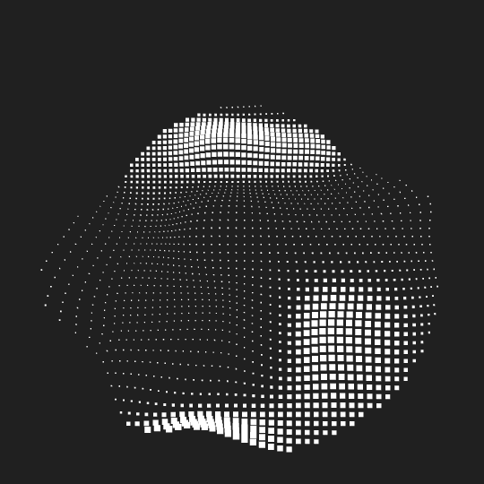
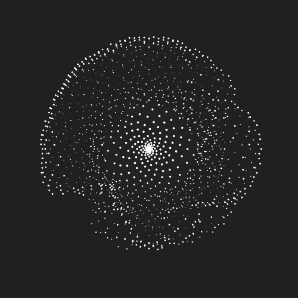
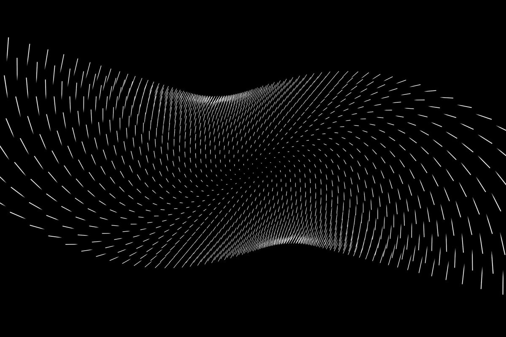
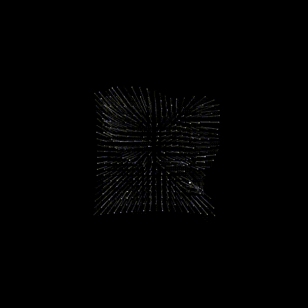

## Examen Pensamiento Computacional
# Figuras en Movimiento

## Información del proyecto

**Nombre del proyecto:** Figuras en Movimiento  
**Autora:** Marina Cossio  
**Asignatura:** Pensamiento Computacional  

### Descripción general

Figuras en Movimiento es un sistema visual interactivo. El proyecto trabaja con una estética digital y pixelada, construida a partir de pequeños cuadrados blancos sobre un fondo oscuro.

La experiencia permite que el usuario interactúe con una figura en movimiento mediante el mouse, clics, botones y teclas. A través de estas acciones, el sistema cambia de estado, transforma la figura, modifica su intensidad y permite guardar capturas del resultado visual.

El proyecto tiene tres estados principales: pantalla de inicio, experiencia principal y pantalla final.

## Descripción objetiva

### Qué es el proyecto

El proyecto es una visualización interactiva generada por código. Está compuesta por una grilla de píxeles que forman distintas figuras en movimiento. Estas figuras cambian según las acciones del usuario.

### Qué se ve en pantalla

En pantalla se ve un fondo oscuro, textos informativos, botones y una figura principal formada por pequeños cuadrados blancos. La figura se mueve constantemente y responde a la posición del mouse.

También aparece un botón de captura en la esquina superior derecha, que permite guardar una imagen del proyecto en cualquier momento.

### Qué elementos visuales aparecen

- Fondo oscuro.
- Píxeles blancos.
- Figuras generadas por código.
- Texto informativo.
- Botón **INICIAR**.
- Botón **FINALIZAR**.
- Botón **REINICIAR**.
- Botón **CAPTURA**.
- Pantalla de inicio.
- Pantalla de experiencia principal.
- Pantalla final.

### Qué inputs utiliza

- Movimiento horizontal del mouse.
- Movimiento vertical del mouse.
- Clic sobre la figura.
- Clic en el botón **INICIAR**.
- Clic en el botón **FINALIZAR**.
- Clic en el botón **REINICIAR**.
- Clic en el botón **CAPTURA**.
- Tecla **R** para reiniciar.
- Tecla **S** para guardar captura.

### Qué outputs genera

- Movimiento de los píxeles.
- Cambio de figura.
- Variación del tamaño de los píxeles.
- Variación de intensidad.
- Cambio entre estados.
- Música de fondo.
- Capturas en formato PNG.

## Descripción conceptual

### Idea central

La idea central del proyecto es representar una figura digital que se transforma a partir de la interacción del usuario. La figura no funciona como una imagen fija, sino como un sistema visual que cambia constantemente.

El usuario participa directamente en la transformación de la figura, ya que sus movimientos y clics modifican lo que ocurre en pantalla.

### Corriente o referente de diseño

El proyecto se relaciona con el **arte cinético** y el **diseño generativo**. Ambas referencias trabajan con movimiento, repetición, transformación y sistemas visuales que cambian en el tiempo.

En este caso, el movimiento no se produce de manera mecánica, sino a través de reglas programadas.

### Principio de diseño explorado

El principio de diseño explorado es la **transformación visual mediante interacción**. A partir de una grilla de píxeles, el sistema genera distintas formas que cambian según los datos que entrega el usuario.

También se exploran la repetición, el movimiento, la variación y la respuesta visual inmediata.

## Sistema computacional

### Inputs

El sistema recibe los siguientes datos de entrada:

- Posición del mouse en el eje X.
- Posición del mouse en el eje Y.
- Clic del mouse.
- Zona donde ocurre el clic.
- Presión de teclas.
- Activación de botones.

### Procesos

El sistema procesa estos datos mediante:

- Variables que controlan estados, figuras, tiempo, intensidad y tamaño.
- Condicionales que deciden qué estado se muestra.
- Condicionales que detectan la zona del clic.
- Bucles `for` que recorren la grilla de píxeles.
- `map()` para transformar datos del mouse en valores visuales.
- `random()` para generar variaciones en cada transformación.
- Funciones propias para organizar el código.

### Estados

El sistema tiene tres estados principales.

#### Estado 0: Inicio

Muestra el título del proyecto, una descripción breve, una vista previa visual y el botón **INICIAR**.

#### Estado 1: Experiencia principal

Muestra la figura pixelada interactiva. En este estado el usuario puede mover el mouse, hacer clic sobre la figura, cambiar de forma, guardar capturas y finalizar la experiencia.

#### Estado 2: Final

Muestra una figura final más pequeña, texto de cierre y el botón **REINICIAR**.

### Eventos

Los eventos del sistema son:

- Clic en **INICIAR**: cambia del estado de inicio a la experiencia principal e inicia la música.
- Movimiento del mouse: modifica el tamaño, energía y deformación de la figura.
- Clic sobre la figura: cambia la figura según la zona donde se hizo clic.
- Clic en **FINALIZAR**: cambia a la pantalla final.
- Clic en **REINICIAR**: vuelve al estado inicial.
- Clic en **CAPTURA**: guarda una imagen del canvas.
- Tecla **R**: reinicia el sistema.
- Tecla **S**: guarda una captura.

### Outputs

El sistema genera los siguientes outputs:

- Figuras pixeladas dinámicas.
- Transformaciones visuales.
- Movimiento constante.
- Cambios de tamaño e intensidad.
- Música de fondo.
- Transiciones entre estados.
- 
## Explicación de la interacción

### Qué datos entran al sistema

Al sistema entran datos entregados por el usuario. Estos datos son principalmente la posición del mouse, los clics y las teclas presionadas.

La posición del mouse permite modificar visualmente la figura. Los clics permiten activar botones o cambiar la forma de la figura. Las teclas permiten reiniciar o guardar capturas.

### Cómo se procesan

El programa procesa los datos mediante variables, condicionales, bucles y funciones.

La posición del mouse se transforma usando `map()`, para convertirla en valores que afectan el tamaño y movimiento de los píxeles. Los clics son revisados mediante condicionales para determinar si ocurrieron sobre un botón o sobre la figura.

Cuando el usuario hace clic sobre la figura, el sistema revisa en qué zona ocurrió el clic.

### Cómo se transforman

Los datos del mouse y los clics se transforman en cambios visuales. El movimiento del mouse modifica la energía y el tamaño de los píxeles. El clic sobre la figura cambia la forma activa y genera nuevos valores aleatorios.

Cada vez que el usuario hace clic sobre la figura, se actualizan variables como `intensidad`, `energiaMouse` y `tamanoPixelBase`. Esto hace que cada transformación sea distinta.

### Qué respuestas producen

Las respuestas del sistema son visuales y sonoras. Visualmente, la figura cambia de forma, se mueve, se deforma y modifica su intensidad. Sonoramente, la música de fondo comienza cuando el usuario inicia la experiencia.

El sistema también responde guardando una imagen cuando el usuario presiona el botón **CAPTURA** o la tecla **S**.

## Recursos multimedia utilizados

### Tipo de recurso utilizado

El recurso multimedia utilizado es sonido.

**Archivo:** `musicafondo.mp3`  
**Tipo:** Audio  

### Función que cumple dentro del proyecto

La música de fondo acompaña la experiencia visual. No aparece desde el inicio, sino que comienza cuando el usuario presiona el botón **INICIAR**.

Su función es reforzar el cambio entre la pantalla inicial y la experiencia principal, generando una atmósfera calmada y digital que acompaña el movimiento de las figuras pixeladas.

## Registro visual

### Referentes

El referente visual principal es una estética digital basada en puntos, píxeles, grillas y contraste entre blanco y negro. También se toma como referencia la idea de volumen generado por repetición de elementos pequeños.

Visualmente, el proyecto se relaciona con imágenes generativas, visualizaciones digitales y composiciones cinéticas donde una forma se construye a partir de unidades mínimas.

### Capturas del proceso

